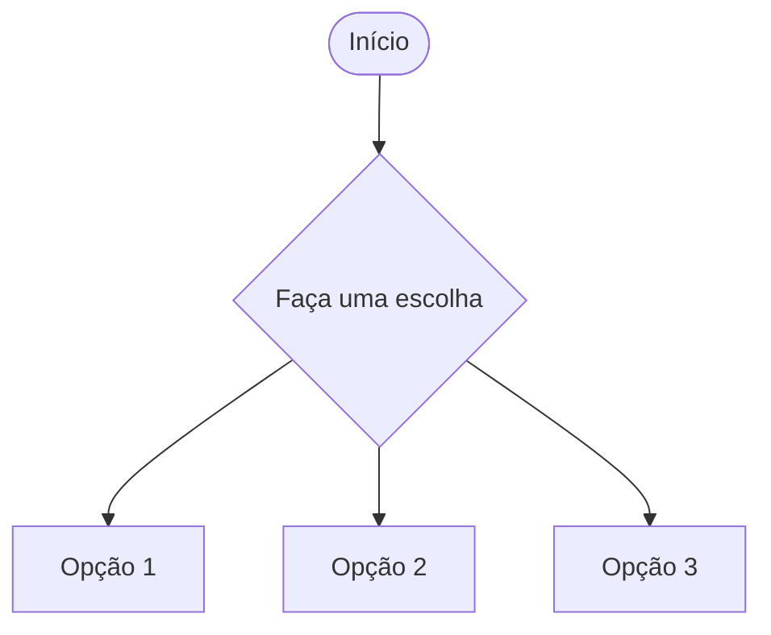
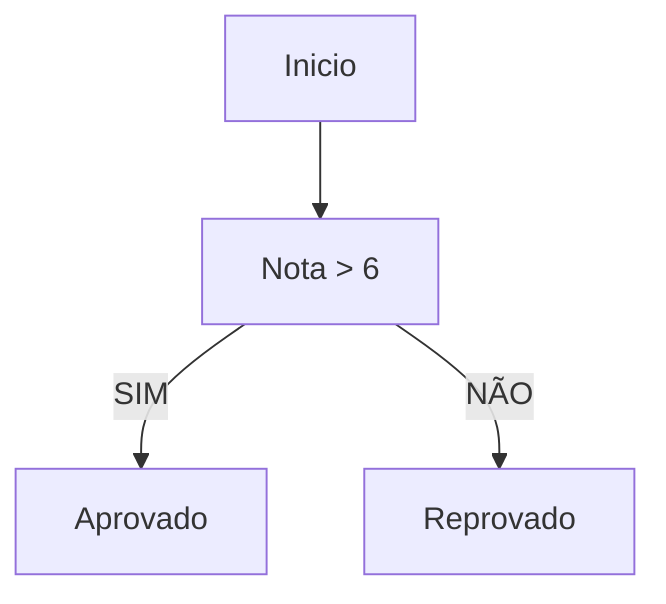
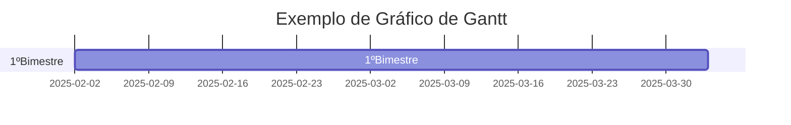

## Fluxograma

```mermaid
flowchart TD
  A(["Início"])
  A --> B{"Faça uma escolha"}
  B --> C["Opção 1"]
  B --> D["Opção 2"]
  B --> E["Opção 3"]

```

```mermaid
graph TD;
A[Inicio] --> B[Nota > 6];
B --> |SIM| C[Aprovado];
B --> |NÃO| D[Reprovado];

```

```mermaid
gantt
title Exemplo de Gráfico de Gantt
dateFormat YYYY-MM-DD
section 1ºBimestre
1ºBimestre :a1, 2025-02-02, 60d
section 2ºBimestre

```
