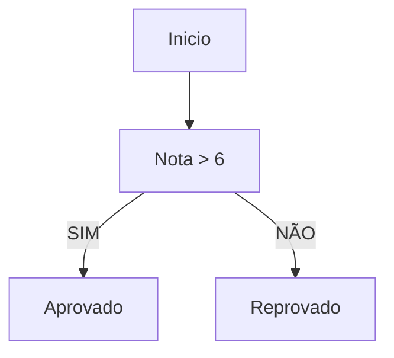
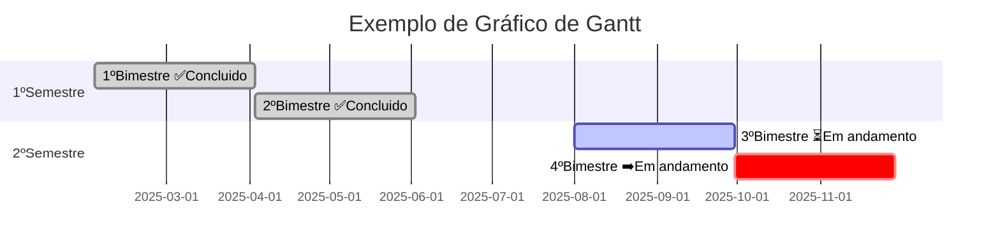
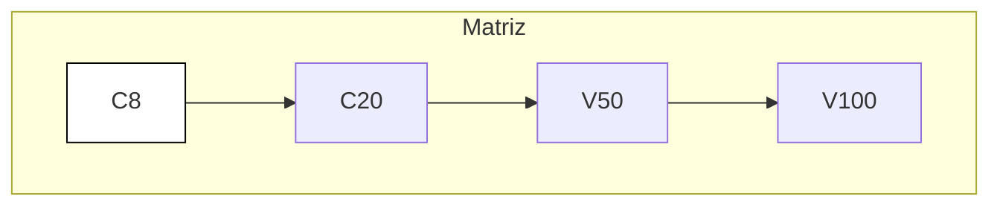

## Fluxograma

```mermaid
flowchart TD
  A(["Início"])
  A --> B{"Faça uma escolha"}
  B --> C["Opção 1"]
  B --> D["Opção 2"]
  B --> E["Opção 3"]

```

```mermaid
graph TD;
A[Inicio] --> B[Nota > 6];
B --> |SIM| C[Aprovado];
B --> |NÃO| D[Reprovado];

```

```mermaid
gantt
title Exemplo de Gráfico de Gantt
dateFormat YYYY-MM-DD
section 1ºSemestre
1ºBimestre ✅Concluido:done, a1, 2025-02-02, 60d
2ºBimestre ✅Concluido:done, a2, after a1, 60d
section 2ºSemestre
3ºBimestre ⏳Em andamento:active, a3, 2025-08-01, 60d
4ºBimestre ➡️Em andamento:crit, a4, after a3, 60d
```

```mermaid
graph TD
  subgraph Matriz
A1["C8"]:::branco --> A2["C20"]:::amarelo --> A3["V50"]:::laranja --> A4["V100"]:::vermelho

  end

classDef branco fill:#fff, stroke:#000, stroke-width:1px;
```
