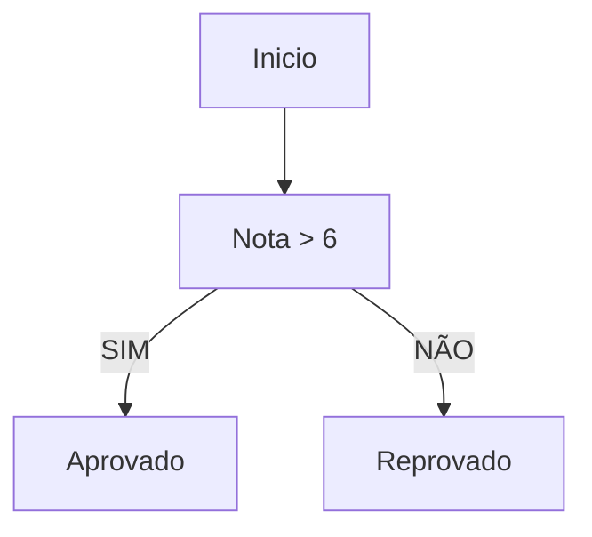
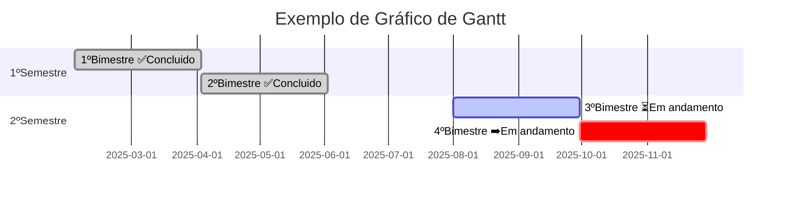
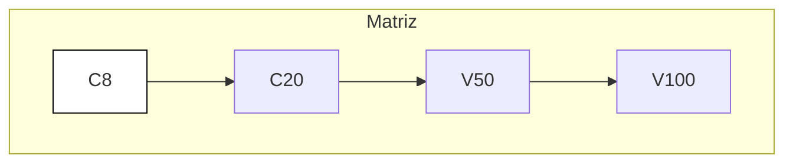
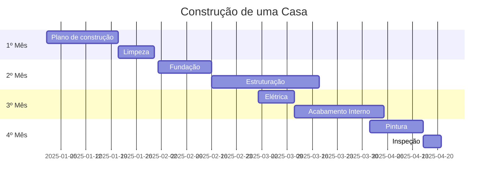
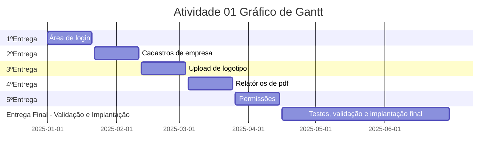
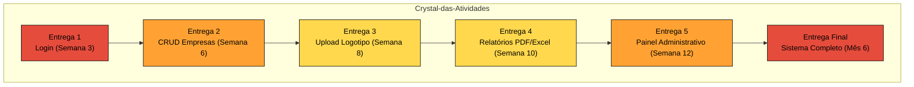

## Fluxograma

```mermaid
flowchart TD
  A(["Início"])
  A --> B{"Faça uma escolha"}
  B --> C["Opção 1"]
  B --> D["Opção 2"]
  B --> E["Opção 3"]

```

```mermaid
graph TD;
A[Inicio] --> B[Nota > 6];
B --> |SIM| C[Aprovado];
B --> |NÃO| D[Reprovado];

```

```mermaid
gantt
title Exemplo de Gráfico de Gantt
dateFormat YYYY-MM-DD
section 1ºSemestre
1ºBimestre ✅Concluido:done, a1, 2025-02-02, 60d
2ºBimestre ✅Concluido:done, a2, after a1, 60d
section 2ºSemestre
3ºBimestre ⏳Em andamento:active, a3, 2025-08-01, 60d
4ºBimestre ➡️Em andamento:crit, a4, after a3, 60d
```

```mermaid
graph TD
  subgraph Matriz
A1["C8"]:::branco --> A2["C20"]:::amarelo --> A3["V50"]:::laranja --> A4["V100"]:::vermelho

  end

classDef branco fill:#fff, stroke:#000, stroke-width:1px;
```

```mermaid
gantt
    title Construção de uma Casa
    dateFormat  YYYY-MM-DD

    section 1º Mês
    Plano de construção        :a1, 2025-01-01, 20d
    Limpeza     :a2, after a1, 10d

    section 2º Mês
    Fundação                   :a3, 2025-02-01, 15d
    Estruturação               :a4, after a3, 30d

    section 3º Mês
    Elétrica     :a5, 2025-03-01, 10d
    Acabamento Interno         :a6, after a5, 25d

    section 4º Mês
    Pintura                    :a7, 2025-04-01, 15d
    Inspeção                   :a8, after a7, 5d

```

```mermaid
gantt
title Atividade 01 Gráfico de Gantt
dateFormat YYYY-MM-DD
section 1ºEntrega
Área de login :login, 2025-01-01, 2025-01-21

section 2ºEntrega
Cadastros de empresa :crud, 2025-01-22, 2025-02-11

section 3ºEntrega
Upload de logotipo :logo, 2025-02-12, 2025-03-04

section 4ºEntrega
Relatórios de pdf :relatorios, 2025-03-05, 2025-03-25

section 5ºEntrega
Permissões :painel, 2025-03-26, 2025-04-15

section Entrega Final - Validação e Implantação
Testes, validação e implantação final :final, 2025-04-16, 2025-06-30

```

```mermaid
graph TD
   subgraph Crystal-das-Atividades
E1["Entrega 1<br/>Login (Semana 3)"]:::vermelho --> 
E2["Entrega 2<br/>CRUD Empresas (Semana 6)"]:::laranja --> 
E3["Entrega 3<br/>Upload Logotipo (Semana 8)"]:::amarelo --> 
E4["Entrega 4<br/>Relatórios PDF/Excel (Semana 10)"]:::amarelo --> 
E5["Entrega 5<br/>Painel Administrativo (Semana 12)"]:::laranja --> 
E6["Entrega Final<br/>Sistema Completo (Mês 6)"]:::vermelho
   end

classDef branco fill:#FFFFFF,stroke:#000,stroke-width:1px,color:#000;
classDef amarelo fill:#FFD84D,stroke:#000,stroke-width:1px,color:#000;
classDef laranja fill:#FFA233,stroke:#000,stroke-width:1px,color:#000;
classDef vermelho fill:#E64C3C,stroke:#000,stroke-width:1px,color:#000;


```
